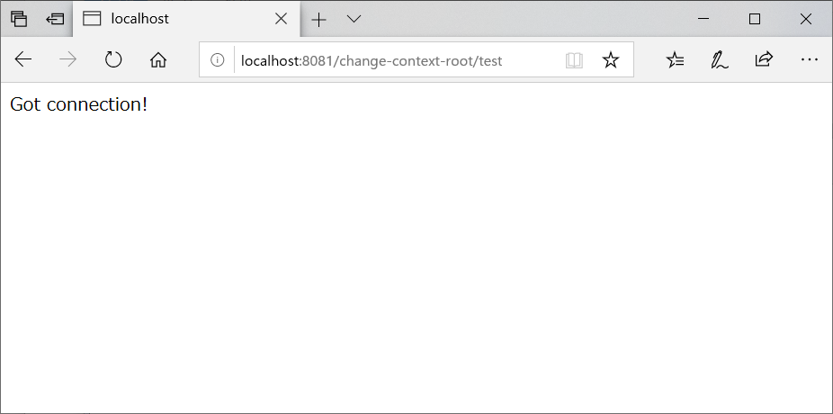

# cargo-jetty-launcher

mvnコマンドだけでWebアプリケーションを実行し、デバッグもできる状態にするランチャー.

Jettyに依存するconfを内包しないWebアプリケーションでも実行できるようにしている.


# Description

Codehaus Cargo を使い、任意のアプリケーションの実行/デバッグ環境構築をmvnコマンドだけで行う.

ちょっと手元でアプリを動かして動作確認したい、障害解析のために特定バージョンをデバッグしたいなどの時に、git clone からの checkout & build で時間を浪費したくない時に役に立つかもしれない.


ソースのcloneやbuildを必要とせず、Maven remote repository または local repository にある war と source-jar だけでセットアップする. アプリケーションのソースを変更することもなく、すでにdeploy済のアプリケーションを簡単に起動することができる.

また、本プロジェクト1つでJettyとWebアプリケーションのセットをいくつでも立ち上げることができる. これにより、バージョン違いの機能評価や複数サーバで構成されるシステムの評価も可能となる.


# Requirement

- JDK 1.8+
- Maven 3.5+

※動作確認したバージョンを記載


# Installation

clone するだけ.

```sh
git clone https://github.com/Piecemeal-Technology-Inc/cargo-jetty-launcher.git
cd cargo-jetty-launcher
```


# Getting start

以下のmvnコマンドでWebアプリケーションが起動する.

```sh
mvn initialize cargo:run
```

http://localhost:8081/change-context-root/test にアクセスすると下記画面が表示されます.




デフォルトでは [org.codehaus.cargo:datasource-war](https://mvnrepository.com/artifact/org.codehaus.cargo/datasource-war)が起動します.

構成としては jetty 9.4 + dbcp2 + h2  となっていて、それぞれがカスタマイズ可能.

## Debugging

以下のmvnコマンドでソースコードをダウンロードする.

```sh
mvn compile
```

ソースは以下のフォルダにダウンロードされる.

```
./target/sources-datasource-war.1.7.11/
```


デフォルトでは9990ポートでリモートデバッグが可能.

リモートデバッグで参照ソースにダウンロードしたソースを指定することで、IDE等でステップ実行が可能となる.

ex) VSCodeの場合 launch.json

```json
{
    "version": "0.2.0",
    "configurations": [
        {
            "type": "java",
            "name": "Debug (Remote 9990)",
            "request": "attach" ,
            "projectName" : "cargo-jetty-launcher",
            "hostName": "localhost",
            "port": 9990,
            "sourcePaths": [
                "${workspaceFolder}/target/sources-datasource-war.1.7.11/main",
                "${workspaceFolder}/target/sources-datasource-war.1.7.11/dependency"
            ]
        }
    ]
}
```


# Usage


## select application

実行時引数で起動するアプリケーションを選択可能。

```sh
ex)
mvn initialize cargo:run -Dtarget.group=hoge -Dtarget.artifact=fuga -Dtarget.version=1.0 -Dcontext.path=hello
```

- target.group
  - 実行Webアプリケーションの groupId を指定
- target.artifact
  - 実行Webアプリケーションの artifactId を指定
- target.version
  - 実行Webアプリケーションの version を指定
- context.path
  - 実行Webアプリケーションのコンテキストルートを指定


## port settings

実行時引数で使用するポートを指定可能.

```sh
ex)
mvn cargo:run -Djetty.port=18080 -Ddebug.port=19990 -Dcargo.rmi.port=8100
```

- jetty.port
  - Webアプリケーションが使用するHTTP ポート
- debug.port
  - リモートデバッグ用のポート
- cargo.rmi.port
  - Codehaus Cargo が使用する管理ポート


## Datasource settings

実行時引数でデータソースパラメータを指定可能.

```sh
ex)
mvn cargo:run -Ddatasource.jndi=jdbc/datasources -Djdbc.driver.class=org.postgresql.Driver -Djdbc.url=jdbc:postgresql://localhost:5432/postgres -Djdbc.user=dbuser -Djdbc.password=pass
```

- datasource.jndi
  - データソースJNDI名
- jdbc.driver.class
  - JDBCドライバクラス
- jdbc.url
  - JDBC接続URI
- jdbc.user
  - DB接続ユーザ名
- jdbc.password
  - DB接続パスワード


## Change JDBC and connection pool 

デフォルトは org.apache.commons:commons-dbcp2 を使用している.

変更する場合は以下を更新する必要がある.

- ./src/main/config/etc/jetty-datasource.xml
  - org.eclipse.jetty.plus.jndi.Resource の引数に渡しているorg.apache.commons.dbcp2.BasicDataSourceを任意のクラスに置き換える
  - 各attributeも置き換えるクラスに応じて書き直す
- pom.xml
  - maven-dependency-pluginのext-lib-copyで依存ライブラリをダウンロードするよう変更する
  - cargo-maven2-pluginの configuration - files にてダウンロードしたライブラリをcopyするように変更する


# Note

- 各phaseについて
  - initialize
    - 事前処理等を行うphase
    - 主にjettybaseの雛型生成と依存ライブラリのDLを行う
  - compile
    - デバッグを行うために必要なソースを source-jar から取得する
    - デバッグの必要がなければ、このphaseを実行する必要はない
- JettyBase名
  - 実行するWebアプリケーションで名前を決定している
    - pom.xml の jetty.base.name 参照
- 複数アプリケーションの同時起動
  - 可能
  - JettyBase名が重複しない限り、同時にそれぞれ起動することが可能
    - ただし、portは重複しないように分けること
- Jettyの拡張
  - 拡張 RequestLog を insertHandler に入れたり、start.d で追加の構成ファイルを投入することは可能